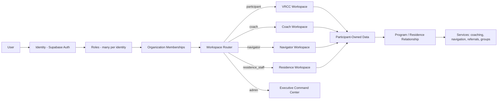
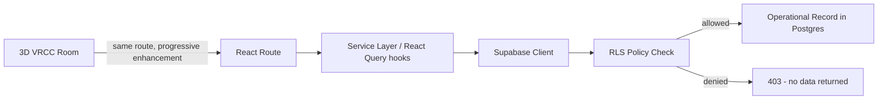

# RecoveryOS — Architecture Audit & Phased Build Map

Status: initial audit. Repository contains no application code as of this writing —
see Section A. This document is the required output of the audit mandated before any
large-scale implementation begins (VRCC + Residence World and Operations Integration Plan).

---

## A. Current State

Repository: `Grace-For-Addictions/RecoveryResidenceOS`, branch `claude/recoveryos-architecture-stack-0tp9gb`.

Inventory as of this audit:

- `README.md` — two lines, project name only.
- No `package.json`, no frontend scaffold, no build tooling.
- No Supabase project linkage, no migrations directory, no SQL.
- No routes, no components, no auth, no RLS policies.
- No Three.js / React Three Fiber scene, no assets.
- No Grace AI integration, no consent system, no intake system.
- No CI, no lint config, no tests.

Conclusion: there is nothing to reuse and nothing to conflict with. This is a greenfield
build against the locked spec, not a migration off an existing (e.g. Base44) system —
there are no Base44 artifacts present to remove. Every item in the Gap Analysis (Section C)
is "missing," not "broken" or "duplicated." No destructive work is required; every gate
below is purely additive.

---

## B. Target State

The architecture required to satisfy the spec, summarized:

- **Frontend**: React 19 + TypeScript + Vite + Tailwind + React Router + PWA shell.
- **Immersive layer**: React Three Fiber / Drei / Three.js scene mounted as a route-level
  layer inside the same React app — not a separate product — with a mandatory 2D-equivalent
  route for every 3D room.
- **Backend**: Supabase (Postgres + Auth + RLS + Storage + Edge Functions + Realtime,
  pgvector for Grace AI retrieval where warranted).
- **Infra**: Cloudflare Pages/DNS/CDN/WAF/Turnstile fronting `vrcc.app`.
- **Identity model**: one human = one `identity` row, many `role` + `organization_membership`
  + `program_assignment` rows. Supabase Auth is identity source of truth; Postgres/RLS is
  authorization source of truth.
- **Participant record**: single longitudinal record per person; programs, residences, and
  services attach to the participant rather than forking the person.
- **Provenance on every participant-owned field**: owner, entered_by, entry_mode
  (self / assisted / on_behalf), created_at, updated_at, source, consent_ref.

---

## C. Gap Analysis

Everything is a gap. Prioritized by what blocks everything else:

1. No frontend scaffold — blocks all UI work.
2. No Supabase project/schema — blocks auth, data, RLS, everything server-side.
3. No identity/role/org model — blocks every workspace and every permission decision.
4. No RLS — until this exists, no participant data may be written even experimentally.
5. No consent architecture — required before any sensitive intake field is collected.
6. No canonical routes (`/vrcc/home`, `/coach`, `/navigator`, `/residences`, `/admin`,
   `/vrcc/onboarding`, `/vrcc/wisdom`) — needed before any workspace UI.
7. No intake, no participant record, no residence model, no Grace AI, no 3D layer.

Nothing is unsafe yet because nothing exists yet. The risk is sequencing: building UI before
RLS, or building intake before consent, would create the exact "silently make staff-entered
data look participant-entered" and privacy failures the spec warns against. The gates in
Section K are ordered specifically to avoid that.

---

## D. Architecture Diagrams

### D.1 Identity → Workspace → Service flow

### D.2 3D room → operational record

The 3D scene never talks to Supabase directly — it dispatches to the same route/service layer
the 2D UI uses, so there is exactly one source of truth per feature (§18 of the spec).

---

## E. Role × Room Access Matrix

Legend: none / public / personal / assigned / facilitator / operational / admin

| Room | Participant | Coach | Navigator | Residence Staff | Residence Provider | RCC Staff | Admin |
|---|---|---|---|---|---|---|---|
| Welcome Center | public | public | public | public | public | public | admin |
| Community Commons | personal | facilitator | public | public | public | facilitator | admin |
| GFARC / Group Rooms | assigned | facilitator | public | none | none | facilitator | admin |
| Coaching Rooms | assigned | assigned | none | none | none | none | admin |
| Navigator Hub | assigned | assigned | assigned | none | none | assigned | admin |
| Career & Opportunity Center | personal | assigned | assigned | none | none | assigned | admin |
| Recovery Capital Studio | personal | assigned | assigned | none | none | none | admin |
| Wisdom Center (`/vrcc/wisdom`) | public | public | public | public | public | public | admin |
| Daily Recovery Pulse Room | personal | assigned | none | none | none | none | admin |
| Reflection Garden | public | public | public | public | public | public | admin |
| Meditation/Prayer Space | public | public | public | public | public | public | admin |
| Volunteer & Purpose Hub | public | facilitator | public | none | none | facilitator | admin |
| Recovery Residence Center | personal | assigned | assigned | operational | operational | none | admin |
| Support Now Center | public (always) | public | public | public | public | public | admin |

Notes:
- "Personal" = the user sees and edits only their own record.
- "Assigned" = requires an active coaching/navigation/residency relationship row, enforced by RLS, not by hiding UI.
- Residence Staff/Provider operational access is further scoped to their own residence(s) via `residence_id` membership — no cross-residence visibility by default.
- Admin access still routes through explicit permission checks and break-glass audit logging (§17), never a blanket bypass.

---

## F. Participant Data Responsibility Matrix

| Workflow | Self-service | Assisted | On behalf (authorized) | Staff-only | System-generated |
|---|---|---|---|---|---|
| Profile & contact info | ✅ | ✅ | ✅ (consent-gated) | — | — |
| Intake | ✅ | ✅ | ✅ (consent-gated) | — | — |
| Immediate needs | ✅ | ✅ | ✅ | — | — |
| Goals | ✅ | ✅ (collaborative) | rare, flagged | — | — |
| Recovery capital / BARC-10 | ✅ | ✅ | — | — | — |
| Daily check-ins / Recovery Pulse | ✅ | — | — | — | — |
| Documents upload | ✅ | ✅ | ✅ | — | — |
| Referrals | view/respond | create+view | — | create | status transitions |
| Appointments/sessions | request/view | schedule | — | — | reminders |
| Residence application | ✅ | ✅ | ✅ | — | — |
| Bed assignment | — | — | — | ✅ | — |
| Admission/discharge | — | — | — | ✅ | audit entry |
| Drug-screen documentation | — | — | — | ✅ | — |
| Consent grants/revocations | ✅ | ✅ (witnessed) | — | — | expiration |
| Audit log entries | — | — | — | — | ✅ |

Every row that allows "assisted" or "on behalf" writes `entry_mode` + `entered_by` on the
record per §2 of the spec — this is enforced at the schema level (NOT NULL columns), not
just by convention.

---

## G. Route Map (canonical, additive)

| Route | Room / Workspace | Access |
|---|---|---|
| `/vrcc/home` | Participant home | participant (default post-login) |
| `/vrcc/onboarding` | Incomplete-profile gate | participant with incomplete profile |
| `/vrcc/welcome` | Welcome Center | public |
| `/vrcc/commons` | Community Commons | public/personal |
| `/vrcc/groups` | GFARC / Group Rooms | assigned/facilitator |
| `/vrcc/coaching` | Coaching Rooms | assigned |
| `/vrcc/navigator` | Navigator Hub (participant view) | assigned |
| `/vrcc/opportunity` | Career & Opportunity Center | personal/assigned |
| `/vrcc/recovery-capital` | Recovery Capital Studio | personal/assigned |
| `/vrcc/wisdom` | Wisdom Center | public |
| `/vrcc/pulse` | Daily Recovery Pulse | personal |
| `/vrcc/garden` | Reflection Garden | public |
| `/vrcc/reflect` | Meditation/Prayer Space | public |
| `/vrcc/volunteer` | Volunteer & Purpose Hub | public/facilitator |
| `/vrcc/residences` | Recovery Residence Center (participant) | personal |
| `/support-now` | Support Now Center | public, persistent (also non-3D global element) |
| `/coach` | Coach Workspace root | coach |
| `/navigator` | Navigator Workspace root | navigator |
| `/residences` | Residence Workspace root (staff/provider) | residence_staff/provider |
| `/rcc` | Recovery Community Center Workspace | rcc_staff/admin |
| `/admin` | Executive Command Center | admin |

Every `/vrcc/*` room has a 3D representation reachable by walking the campus **and** this
direct route — same component tree, same data hooks, 3D is a presentation layer only.

---

## H. Database Map (initial additive schema — Gate 1 scope)

Domains and core tables to create (all new — no existing schema to reconcile):

- **identity**: `identities`, `identity_roles`, `role_permissions`
- **organizations**: `organizations`, `organization_memberships`, `locations`
- **participants**: `participants` (1:1 with identity when identity has participant role), `participant_relationships` (coach/navigator ↔ participant, typed + time-bounded)
- **intake**: `intake_forms`, `intake_responses` (with `entry_mode`, `entered_by`, `source`)
- **consent**: `consent_types`, `consent_grants`, `consent_log`
- **programs**: `programs`, `program_enrollments` (GFARC, Live-Out, ANCHOR, Wraparound)
- **coaching/navigation**: `sessions`, `goals`, `action_steps`, `immediate_needs`
- **residences** (Gate 3): `providers`, `residences`, `rooms`, `beds`, `applications`, `waitlist_entries`, `admissions`, `resident_events`
- **resources/referrals**: `resources`, `referrals`, `referral_events`
- **recovery capital**: `recovery_capital_assessments`, `checkins`
- **grace ai** (Gate 8): `rtm_slogans` (canonical 59), `tapes_we_carry`, `grace_conversations`, `grace_messages`
- **audit**: `audit_log` (append-only, generic event table with `actor_id`, `subject_id`, `event_type`, `metadata`, no free-text PII in `metadata`)

All tables use `uuid` PKs, `created_at`/`updated_at`, and soft-delete (`archived_at`) rather
than hard deletes where the record has legal/audit weight (consent, admissions, referrals).

---

## I. RLS Plan

Baseline rules, enforced in Postgres (never solely in the frontend):

1. **Identity**: a user can always `SELECT`/`UPDATE` their own `identities` row.
2. **Participants**: a participant can `SELECT`/`UPDATE` their own `participants` row and
   child rows (goals, checkins, documents, needs) unless a field is explicitly staff-only.
3. **Assigned relationships**: coach/navigator access to a participant's records is gated
   by an active row in `participant_relationships` matching their identity, scoped to the
   fields their role is permitted to see (e.g., coaches don't get residence drug-screen data).
4. **Organization scoping**: RCC/residence data is scoped by `organization_memberships` —
   a policy predicate joins through membership, never a client-side `WHERE org_id = ...`
   that the client could omit.
5. **Residence scoping**: residence staff/providers see only residences they're a member of,
   via `residence_staff_memberships`.
6. **Consent-gated fields**: certain columns (e.g. legal history, health-adjacent fields) live
   in separate tables with their own RLS predicate requiring a valid, unexpired `consent_grants`
   row for the requesting actor's purpose.
7. **Admin**: admin policies are explicit per-table grants keyed to `role_permissions`, not a
   single `is_admin() → true` bypass; break-glass access (if implemented) writes to `audit_log`
   in the same transaction as the read/write it authorizes.
8. **Audit log**: insert-only for the app role; no update/delete policy exists at all.

---

## J. 3D Technical Architecture (Layer E/F, later gates)

- **Scene architecture**: one persistent `<Canvas>` mounted at the `/vrcc/*` layout level;
  rooms are lazy-loaded scene chunks keyed to the route, not a single monolithic GLB.
- **Asset loading**: glTF/GLB via `useGLTF` + Draco compression, suspense boundaries per room,
  texture compression (KTX2/Basis), asset CDN via Cloudflare.
- **Avatar system**: preset-based (no photo requirement), skeletal animation for idle/walk/sit/
  gesture, driven by the same participant profile record as the 2D UI.
- **NPC/pedestrian system**: instanced meshes + simple state machine (idle/walk/interact),
  spawn/despawn outside camera frustum, capped population with LOD.
- **Vehicle/traffic system**: waypoint-graph driven, instanced, traffic-light state machine,
  capped active count with off-screen recycling — explicitly not a full traffic sim.
- **Room transitions**: route change → unmount previous scene chunk, mount next, shared
  lighting/environment rig persists to avoid pop.
- **Performance tiers**: device capability probe on load → Immersive View vs Standard View
  toggle persisted per user; Standard View is the full-parity 2D app, not a stripped demo.
- **Reduced motion / accessibility**: `prefers-reduced-motion` disables ambient animation and
  camera easing by default; all interactive objects have a keyboard/screen-reader equivalent
  control in the 2D layer per §22.

This layer is explicitly out of scope until Layers A–D (foundation, service ops, residence ops,
functional VRCC routes) exist and are stable, per the spec's own sequencing.

---

## K. Implementation Gates (proposed sequence)

**Gate 1 — Project scaffold + Identity/Org/Role foundation**
- Scope: Vite/React 19/TS/Tailwind/React Router app shell; Supabase project schema for
  identity, roles, organizations, memberships; base RLS; canonical route stubs
  (`/vrcc/home`, `/vrcc/onboarding`, `/coach`, `/navigator`, `/residences`, `/admin`) with
  auth-gated placeholder screens and role-based redirect.
- Database: `identities`, `identity_roles`, `role_permissions`, `organizations`,
  `organization_memberships`, `locations`.
- Security: RLS on all new tables per Section I items 1, 4, 7, 8.
- Verification: sign up as each role, confirm correct canonical redirect; confirm a second
  test user cannot read another identity's row via the Supabase client.
- Excludes: intake, consent, participant record, residences, 3D, Grace AI.

**Gate 2 — Consent architecture**
- Scope: consent types/grants/log tables, participant-facing consent UI, RLS predicate helper
  used by later gates.
- Excludes: any sensitive intake field that would depend on it — built after this gate.

**Gate 3 — Participant record + Intake**
- Scope: `participants`, `participant_relationships`, `intake_forms`, `intake_responses` with
  `entry_mode`/`entered_by`; self-serve + assisted intake UI; identity resolution to prevent
  duplicate participant records on assisted intake.

**Gate 4 — Service Operations (Coaching/Navigation/Programs/Referrals)**
- Scope: goals, sessions, immediate needs, resources, referrals; Coach and Navigator workspace
  screens against real data.

**Gate 5 — ResidenceOS**
- Scope: providers, residences, beds, applications, waitlist, admissions, resident portal.

**Gate 6 — Functional VRCC routes (2D)**
- Scope: every `/vrcc/*` room from Section G as a real 2D page wired to the domains above
  (Wisdom Center, Recovery Capital Studio, Daily Pulse, Support Now persistent element, etc).

**Gate 7 — Immersive VRCC (3D)**
- Scope: R3F campus shell, room transitions mapped 1:1 to Gate 6 routes, avatar system,
  Immersive/Standard toggle.

**Gate 8 — Des Moines Living City + Grace AI + Executive Command Center**
- Scope: traffic/pedestrian systems, Grace AI companion (canonical 59 slogans, Recovery
  Reasoning Engine), aggregate reporting dashboards.

Each gate ships as its own PR against `claude/recoveryos-architecture-stack-0tp9gb` (or a
child branch), with build/lint/test verification before merge, per §33.

---

*This document supersedes no existing code because none exists. It should be revised as
gates land rather than treated as immutable.*
